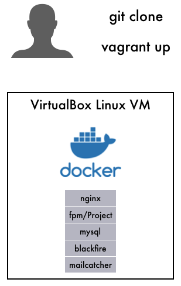

# Symfony 4 application with Docker in Vagrant



A Symfony 4 application running inside Docker in an automatically provisioned Vagrant box.

You can use this example for easy local development and to create Docker images ready to be run on a server with Docker enabled.

It's very useful if you want all your developers to work with the exact some software versions and configurations. And to generate
Docker images you can use to run the exact same software on a production server.

Includes:

- Symfony 4 demo app
- Vagrant provisioning with [vagrant-scripts](https://github.com/iwf-web/vagrant-scripts)
- This documentation


It's based on our Open source Docker images:

- PHP 7.3: [IWF PHP base image on Dockerhub](https://hub.docker.com/repository/docker/iwfwebsolutions/phpfpm)
- Nginx 1.14: [IWF Nginx base image on Dockerhub](https://hub.docker.com/repository/docker/iwfwebsolutions/nginx)
- MySQL 5.7: [IWF MySQL base image on Dockerhub](https://hub.docker.com/repository/docker/iwfwebsolutions/mysql)


The following components are used:

- PHP 7.3
- Nginx 1.14
- MySQL 5.7
- PhpMyAdmin


For local development the following tools are available:

- XDebug
- Blackfire
- Panther
- Composer
- Yarn


# Requirements

To run this example project you need:

- [Vagrant](https://www.vagrantup.com)
- [VirtualBox](https://www.virtualbox.org)

If you don't have an Account on [Dockerhub](https://www.dockerhub.com) you should create one.
The setup process will ask you for the credentials.

You should also install these vagrant plugins:

- vagrant-notifyforwarder
- vagrant-hostsupdater
- vagrant-vbguest

If you're running Windows you should also install:

- vagrant-gatling-rsync
- vagrant-rsync-back

Install plugins like this:

```
vagrant plugin install vagrant-notifyforwarder
vagrant plugin install vagrant-hostsupdater
vagrant plugin install vagrant-vbguest
```

# Setup this project

Just run:

```
./bin/init_project.sh
cd docker/vagrant
vagrant up
```

It takes about 10-15 minutes, depending on your Internet and machine speed.

After everything is completed, a message is displayed saying:

```
Machine was booted, startup scripts are running inside the docker containers - please wait. 
If you're curious, you can execute 'docker logs -t fpm' inside vagrant or use the docker-logs.sh script. 
Once finished, the application will be available on http://symfony-vagrant-docker-example
``` 

Now you can browse to http://symfony-vagrant-docker-example and you should see the "Welcome to Symfony 4.x.x" message.


# Learn more & start working

- [Understand the project structure](docs/structure.md)
- [Customize & handle your Vagrant box](docs/vagrant.md)
- [Understand the Docker](docs/docker.md)
- [Setup PhpStorm for development](docs/phpstorm.md)
- [Recipes, Tips & How To's](docs/tips.md)


# Contribute!

Contribute to this project and all the other's by creating issues & pull requests.

Thanks for your help!


# Get help

Use the [issue system on Github](https://github.com/iwf-web/symfony-vagrant-docker-example/issues) to report errors or suggestions.

You can also write to opensource@iwf.io. We try to answer every question, but it might take some days.

 
